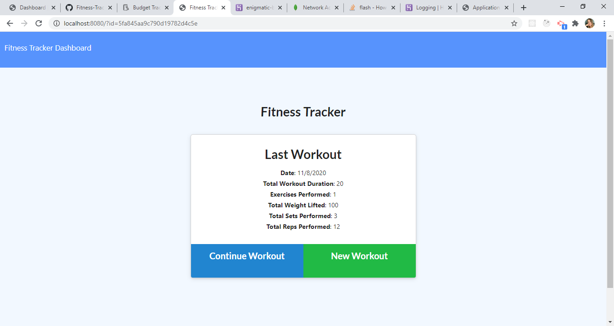
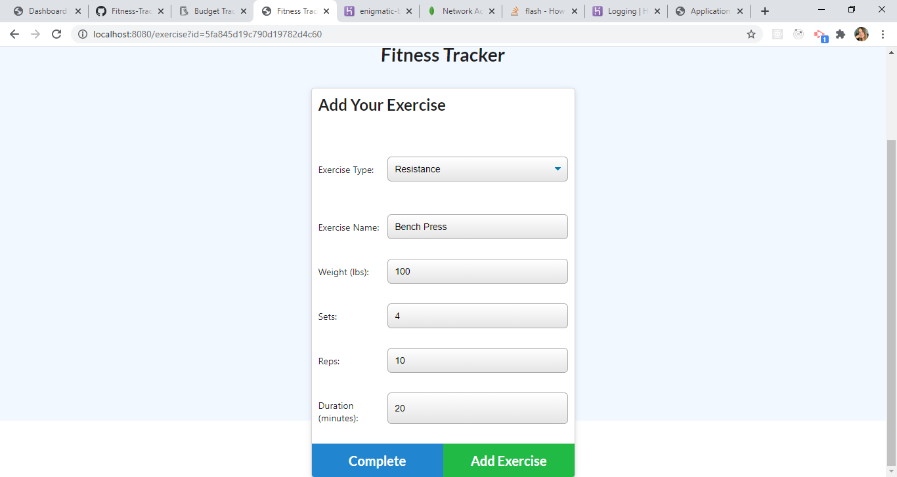
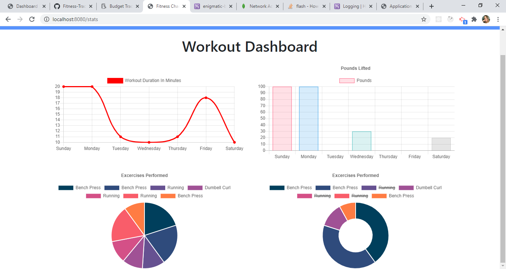

# Fitness-Tracker

## Objective
This application uses a Mongo database to track workout activity. The user is able to log new workouts and view statistics on their past workouts. The application uses JavaScript, Node.js, Express, MongoDB and Mongoose.  

**The Fitness Tracker Home Page**    
  
**The Add Workout Page**  
  
**The Workout Dashboard Page**  
  
